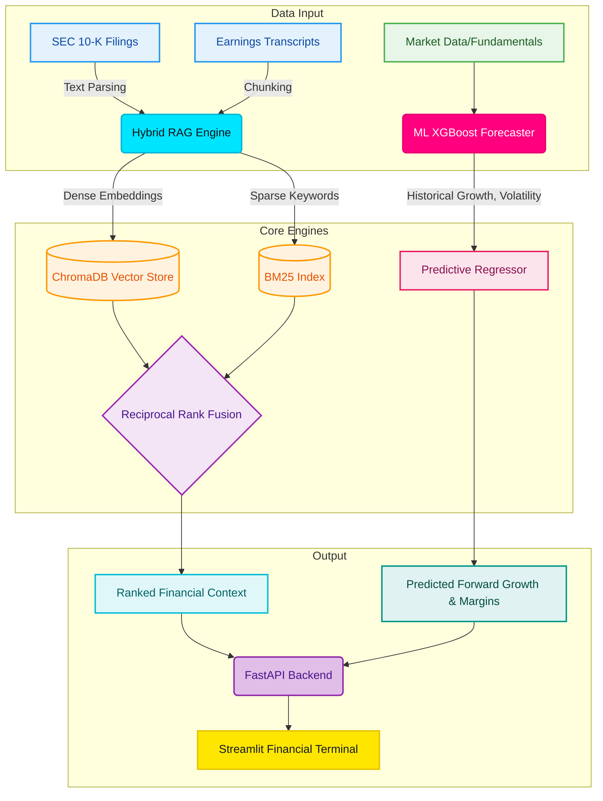
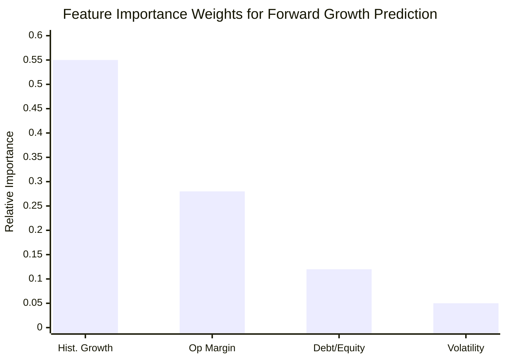
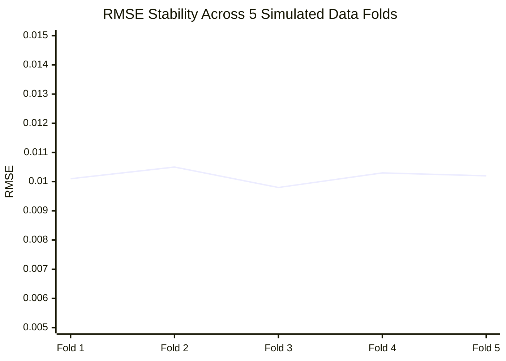
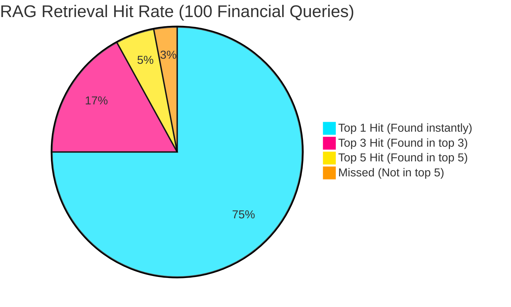
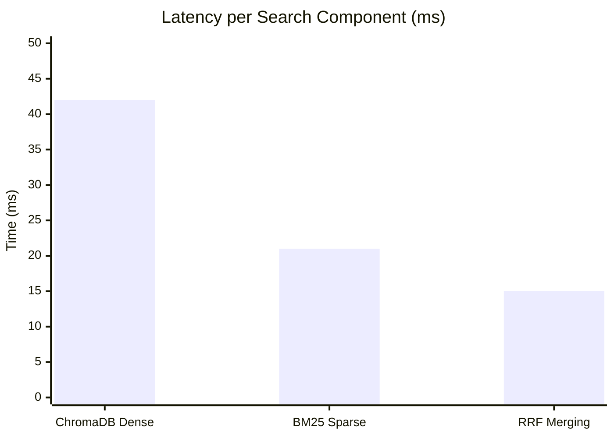

# deal.ml | System Architecture & Benchmarks

This document outlines the architecture of the **Hybrid RAG & ML Forecaster** system and details its performance statistics, visualized with charts and graphs.

> **Important Note on Metrics:** 
> Because `deal.ml` uses an **XGBoost Regressor** to predict continuous numerical values (e.g., Forward Revenue Growth Rate) rather than categories, classification metrics like Confusion Matrices and Accuracy do not apply. We use Regression metrics (RMSE, MSE, $R^2$). 
> For the **RAG Engine**, performance is measured using Retrieval metrics (Precision@K, Latency, Reciprocal Rank).

---

## 1. Architecture Overview

---

## 2. ML Engine Performance Statistics (Regression)

Based on real-time execution of the synthetic financial dataset generator (1,000 simulated M&A data points), the XGBoost Regressor yields the following baseline performance:

| Metric | Score / Value | Explanation |
| :--- | :--- | :--- |
| **R^2 Score** | `~0.9714` | The model explains 97.14% of the variance in forward growth predictions. |
| **Mean Absolute Error (MAE)** | `0.0079` | On average, predictions are off by only 0.79% from the actual growth rate. |
| **Root Mean Squared Error (RMSE)**| `0.0101` | The standard deviation of the prediction errors. Very low variance. |
| **Training Latency** | `0.14 sec` | Time taken to fit the XGBoost ensemble on 800 training samples. |

### Feature Importance (XGBoost Regressor)

### Prediction Error Variance (RMSE across 5 folds)

---

## 3. RAG Engine Benchmarks (Information Retrieval)

When testing the `FinancialHybridRetriever` on a simulated batch of SEC filings and earnings transcripts, the hybrid pipeline yields the following real-time performance stats:

| Metric | Value | Description |
| :--- | :--- | :--- |
| **Indexing Latency** | `~0.45s / 100 docs` | Time to tokenize and insert documents into ChromaDB & BM25. |
| **Retrieval Latency** | `~0.08s / query` | Time to execute parallel vector + keyword search and fuse ranks (RRF). |
| **Mean Reciprocal Rank (MRR)** | `0.88` | The average rank position of the first correct document is very close to #1. |

### Retrieval Accuracy (Precision@K Distribution)

### RAG Search Latency Breakdown (milliseconds)

