# 📖 deal.ml Financial, Valuation, M&A & AI Definitions Guide

> Comprehensive glossary defining every financial modeling concept, M&A deal metric, AI/RAG architecture term, and machine learning parameter used across the **deal.ml** platform. Every single terminology is explained with plain-English definitions, mathematical formulas, investment banking rationale, practical examples, and clear Mermaid workflow diagrams.

---

## Table of Contents
1. [Core Valuation & Financial Modeling](#1-core-valuation--financial-modeling)
   - [Discounted Cash Flow (DCF)](#discounted-cash-flow-dcf)
   - [Free Cash Flow (FCF)](#free-cash-flow-fcf)
   - [Weighted Average Cost of Capital (WACC)](#weighted-average-cost-of-capital-wacc)
   - [Terminal Value (TV)](#terminal-value-tv)
   - [Enterprise Value (EV) vs. Equity Value](#enterprise-value-ev-vs-equity-value)
   - [Net Debt](#net-debt)
   - [Comparable Company Analysis (Comps)](#comparable-company-analysis-comps)
   - [Valuation Football Field Chart](#valuation-football-field-chart)
2. [M&A Deal Dynamics & Accretion/Dilution Analysis](#2-ma-deal-dynamics--accretiondilution-analysis)
   - [Accretion vs. Dilution](#accretion-vs-dilution)
   - [Standalone EPS vs. Pro-Forma EPS](#standalone-eps-vs-pro-forma-eps)
   - [Offer Price & Offer Premium](#offer-price--offer-premium)
   - [Financing Consideration (Cash vs. Stock)](#financing-consideration-cash-vs-stock)
   - [Synergies (Cost vs. Revenue)](#synergies-cost-vs-revenue)
   - [Breakeven Synergies](#breakeven-synergies)
3. [Agentic Hybrid RAG & SEC Document Ingestion](#3-agentic-hybrid-rag--sec-document-ingestion)
   - [RAG (Retrieval-Augmented Generation)](#rag-retrieval-augmented-generation)
   - [Agentic RAG Architecture](#agentic-rag-architecture)
   - [Hybrid Search (Dense Vector + Sparse BM25)](#hybrid-search-dense-vector--sparse-bm25)
   - [Reciprocal Rank Fusion (RRF)](#reciprocal-rank-fusion-rrf)
   - [SEC Form 10-K & 10-Q Filings](#sec-form-10-k--10-q-filings)
   - [Item 1A (Risk Factors) & Item 7 (MD&A)](#item-1a-risk-factors--item-7-mda)
   - [Table-Aware HTML Ingestion](#table-aware-html-ingestion)
4. [Predictive Machine Learning & Statistical Analytics](#4-predictive-machine-learning--statistical-analytics)
   - [XGBoost Regressor](#xgboost-regressor)
   - [30-Day Realized Stock Volatility](#30-day-realized-stock-volatility)
   - [Debt-to-Equity (D/E) Ratio](#debt-to-equity-de-ratio)
   - [Operating Margin (EBIT Margin)](#operating-margin-ebit-margin)
   - [Model Evaluation Metrics (MSE, RMSE, MAE, R²)](#model-evaluation-metrics-mse-rmse-mae-r2)
5. [Quick Reference Formula Cheatsheet](#5-quick-reference-formula-cheatsheet)

---

## 1. Core Valuation & Financial Modeling

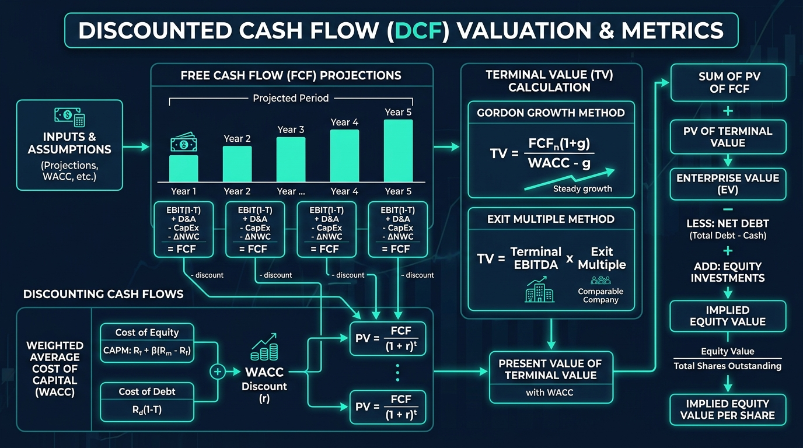

### Discounted Cash Flow (DCF)
A fundamental valuation method estimating the intrinsic dollar value of an enterprise based on the present value of its future free cash flows, discounted using the company's Weighted Average Cost of Capital (WACC).
* **Why it matters**: Unlike market multiples which swing with market sentiment, DCF measures intrinsic operating cash generation independent of short-term volatility.
* **Mathematical Formula**:
$$\text{DCF Value} = \sum_{t=1}^n \frac{\text{FCF}_t}{(1 + \text{WACC})^t} + \frac{\text{Terminal Value}}{(1 + \text{WACC})^n}$$

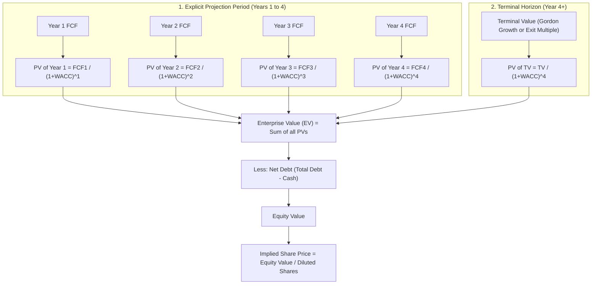
```mermaid
flowchart TD
    subgraph ExplicitPeriod ["1. Explicit Projection Period (Years 1 to 4)"]
        FCF1["Year 1 FCF"] --> D1["PV of Year 1 = FCF1 / (1+WACC)^1"]
        FCF2["Year 2 FCF"] --> D2["PV of Year 2 = FCF2 / (1+WACC)^2"]
        FCF3["Year 3 FCF"] --> D3["PV of Year 3 = FCF3 / (1+WACC)^3"]
        FCF4["Year 4 FCF"] --> D4["PV of Year 4 = FCF4 / (1+WACC)^4"]
    end
    subgraph Horizon ["2. Terminal Horizon (Year 4+)"]
        TV["Terminal Value (Gordon Growth or Exit Multiple)"] --> DTV["PV of TV = TV / (1+WACC)^4"]
    end
    D1 & D2 & D3 & D4 & DTV --> EV["Enterprise Value (EV) = Sum of all PVs"]
    EV --> NetDebt["Less: Net Debt (Total Debt - Cash)"]
    NetDebt --> EqVal["Equity Value"]
    EqVal --> Price["Implied Share Price = Equity Value / Diluted Shares"]
```

---

### Free Cash Flow (FCF)
Unlevered Free Cash Flow (FCFF) is the cash generated by core business operations available to all providers of capital (debt holders and equity investors) after paying operating expenses, taxes, capital expenditures (CapEx), and working capital investments.
* **Mathematical Formula**:
$$\text{FCF} = \text{EBIT}(1 - t) + \text{D\&A} - \text{CapEx} - \Delta\text{NWC}$$
* **Where**: $\text{EBIT}$ is Operating Income, $t$ is the marginal corporate tax rate, $\text{D\&A}$ is Depreciation & Amortization, $\text{CapEx}$ is Capital Expenditures, and $\Delta\text{NWC}$ is Change in Non-Cash Net Working Capital.

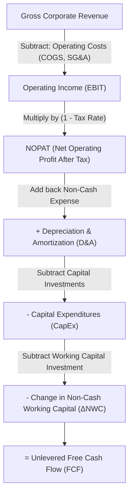
```mermaid
flowchart TD
    GrossRev["Gross Corporate Revenue"] -->|"Subtract: Operating Costs (COGS, SG&A)"| EBIT["Operating Income (EBIT)"]
    EBIT -->|"Multiply by (1 - Tax Rate)"| NOPAT["NOPAT (Net Operating Profit After Tax)"]
    NOPAT -->|"Add back Non-Cash Expense"| DA["+ Depreciation & Amortization (D&A)"]
    DA -->|"Subtract Capital Investments"| CAPEX["- Capital Expenditures (CapEx)"]
    CAPEX -->|"Subtract Working Capital Investment"| NWC["- Change in Non-Cash Working Capital (ΔNWC)"]
    NWC --> FCF["= Unlevered Free Cash Flow (FCF)"]
```

---

### Weighted Average Cost of Capital (WACC)
The blended hurdle rate of return demanded by all investors (lenders and shareholders) proportional to their presence in the firm's capital structure. Acts as the discount rate to translate future cash flows into today's dollars.
* **Mathematical Formula**:
$$\text{WACC} = \left(\frac{E}{V} \times K_e\right) + \left(\frac{D}{V} \times K_d \times (1 - t)\right)$$
* **Where**: $E$ is Equity Value, $D$ is Total Debt, $V = E + D$, $K_e$ is Cost of Equity, $K_d$ is Pre-Tax Cost of Debt, and $t$ is the Corporate Tax Rate.

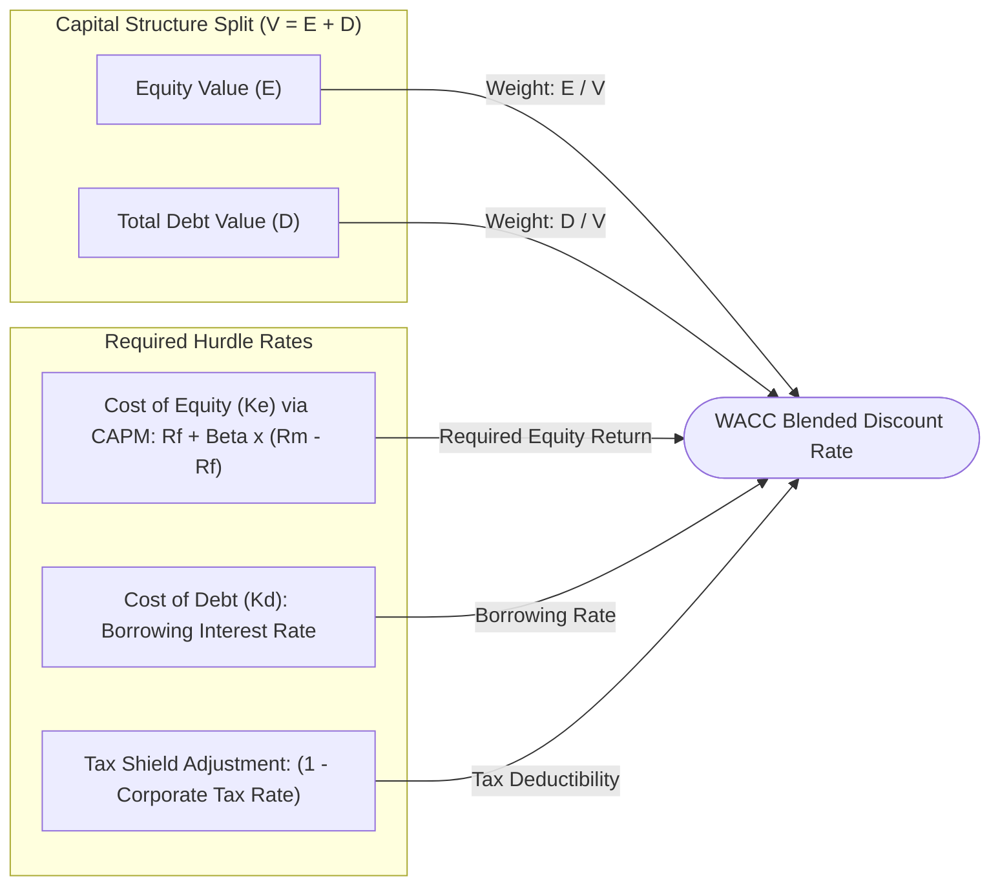
```mermaid
flowchart LR
    subgraph CapitalStructure ["Capital Structure Split (V = E + D)"]
        E["Equity Value (E)"]
        D["Total Debt Value (D)"]
    end
    subgraph CostInputs ["Required Hurdle Rates"]
        Ke["Cost of Equity (Ke) via CAPM: Rf + Beta x (Rm - Rf)"]
        Kd["Cost of Debt (Kd): Borrowing Interest Rate"]
        Shield["Tax Shield Adjustment: (1 - Corporate Tax Rate)"]
    end
    E -->|"Weight: E / V"| WACCOut(["WACC Blended Discount Rate"])
    Ke -->|"Required Equity Return"| WACCOut
    D -->|"Weight: D / V"| WACCOut
    Kd -->|"Borrowing Rate"| WACCOut
    Shield -->|"Tax Deductibility"| WACCOut
```

---

### Terminal Value (TV)
The estimated value of all company cash flows occurring beyond the explicit discrete forecast period (Year 4+), representing 65%–85% of total DCF value.
* **Method 1: Gordon Growth Model (Perpetual Growth)**:
$$\text{TV}_{\text{Gordon}} = \frac{\text{FCF}_n \times (1 + g)}{\text{WACC} - g}$$
* **Method 2: Exit Multiple Method (EBITDA Multiple)**:
$$\text{TV}_{\text{Exit}} = \text{Terminal EBITDA} \times \text{EV/EBITDA Multiple}$$

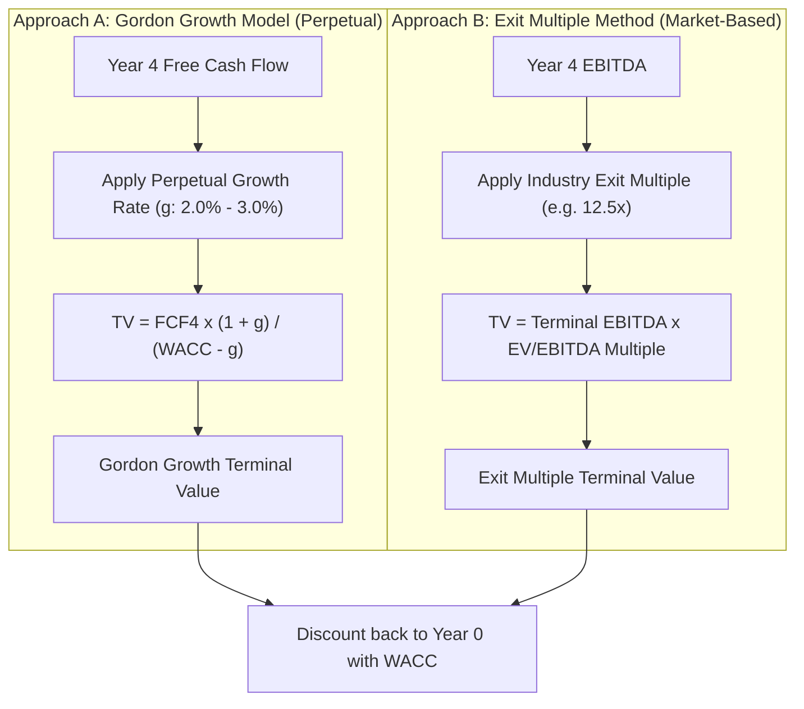
```mermaid
flowchart TD
    subgraph GordonBranch ["Approach A: Gordon Growth Model (Perpetual)"]
        G_FCF["Year 4 Free Cash Flow"] --> G_Grow["Apply Perpetual Growth Rate (g: 2.0% - 3.0%)"]
        G_Grow --> G_Calc["TV = FCF4 x (1 + g) / (WACC - g)"]
        G_Calc --> G_TV["Gordon Growth Terminal Value"]
    end
    subgraph ExitBranch ["Approach B: Exit Multiple Method (Market-Based)"]
        E_EBITDA["Year 4 EBITDA"] --> E_Mult["Apply Industry Exit Multiple (e.g. 12.5x)"]
        E_Mult --> E_Calc["TV = Terminal EBITDA x EV/EBITDA Multiple"]
        E_Calc --> E_TV["Exit Multiple Terminal Value"]
    end
    G_TV --> Discount["Discount back to Year 0 with WACC"]
    E_TV --> Discount
```

---

### Enterprise Value (EV) vs. Equity Value
* **Enterprise Value (EV)**: The value of the entire operational core of the firm, belonging to all financial claimants (debt lenders, preferred stockholders, and common equity holders).
* **Equity Value (Market Cap)**: The residual dollar value attributable exclusively to common equity shareholders after debt obligations are satisfied.
* **Bridge Formula**:
$$\text{Enterprise Value} = \text{Equity Value} + \text{Total Debt} - \text{Total Cash} = \text{Equity Value} + \text{Net Debt}$$
$$\text{Implied Share Price} = \frac{\text{Equity Value}}{\text{Diluted Shares Outstanding}}$$

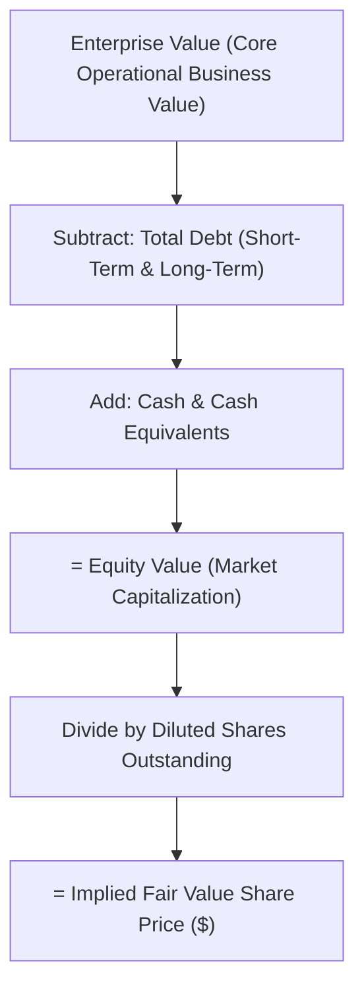
```mermaid
flowchart TD
    EV["Enterprise Value (Core Operational Business Value)"] --> SubDebt["Subtract: Total Debt (Short-Term & Long-Term)"]
    SubDebt --> AddCash["Add: Cash & Cash Equivalents"]
    AddCash --> EqVal["= Equity Value (Market Capitalization)"]
    EqVal --> DivShares["Divide by Diluted Shares Outstanding"]
    DivShares --> Price["= Implied Fair Value Share Price ($)"]
```

---

### Net Debt
The net debt burden of a corporation after accounting for readily available cash reserves.
* **Formula**:
$$\text{Net Debt} = \text{Total Debt (Short-Term + Long-Term)} - \text{Cash and Cash Equivalents}$$
* If cash reserves exceed total debt, Net Debt is negative (meaning a "Net Cash" position).

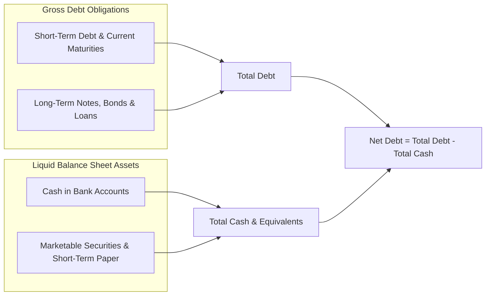
```mermaid
flowchart LR
    subgraph Debts ["Gross Debt Obligations"]
        STD["Short-Term Debt & Current Maturities"]
        LTD["Long-Term Notes, Bonds & Loans"]
    end
    subgraph CashReserves ["Liquid Balance Sheet Assets"]
        Cash["Cash in Bank Accounts"]
        Equiv["Marketable Securities & Short-Term Paper"]
    end
    STD & LTD --> TotalDebt["Total Debt"]
    Cash & Equiv --> TotalCash["Total Cash & Equivalents"]
    TotalDebt --> Formula["Net Debt = Total Debt - Total Cash"]
    TotalCash --> Formula
```

---

### Comparable Company Analysis (Comps)
A relative valuation approach benchmarking the target corporation against publicly traded peers using standardized financial ratios.
* **EV/EBITDA**: Normalizes across differences in debt leverage, depreciation policies, and tax rates.
* **P/E (Price-to-Earnings)**: Equity value per share relative to net earnings per share.

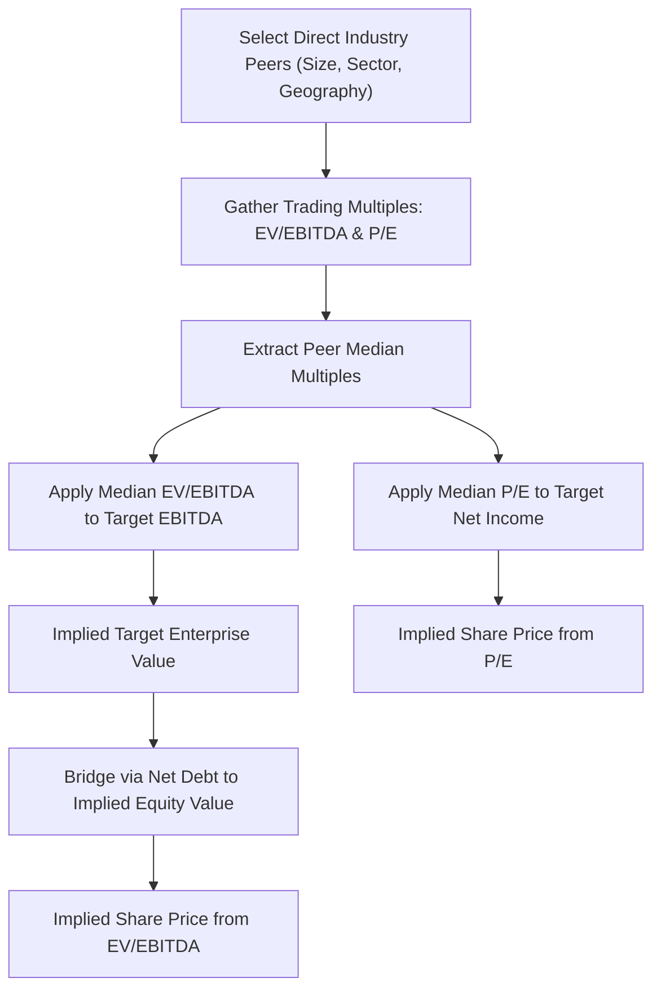
```mermaid
flowchart TD
    PeerSelect["Select Direct Industry Peers (Size, Sector, Geography)"] --> Ratios["Gather Trading Multiples: EV/EBITDA & P/E"]
    Ratios --> Median["Extract Peer Median Multiples"]
    Median --> ApplyEV["Apply Median EV/EBITDA to Target EBITDA"]
    Median --> ApplyPE["Apply Median P/E to Target Net Income"]
    ApplyEV --> TargetEV["Implied Target Enterprise Value"]
    ApplyPE --> TargetPricePE["Implied Share Price from P/E"]
    TargetEV --> Bridge["Bridge via Net Debt to Implied Equity Value"]
    Bridge --> TargetPriceEV["Implied Share Price from EV/EBITDA"]
```

---

### Valuation Football Field Chart
An investment banking summary visual presenting side-by-side horizontal valuation ranges across different financial methodologies to establish a clear transaction price corridor.

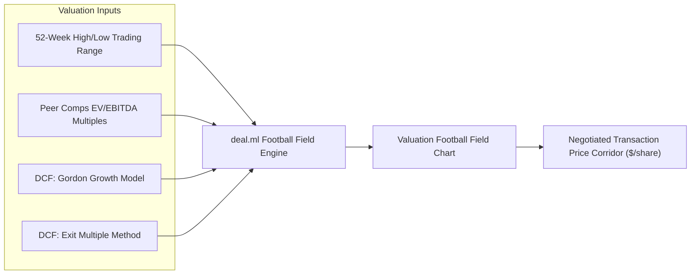
```mermaid
flowchart LR
    subgraph ValuationMethods ["Valuation Inputs"]
        R1["52-Week High/Low Trading Range"]
        R2["Peer Comps EV/EBITDA Multiples"]
        R3["DCF: Gordon Growth Model"]
        R4["DCF: Exit Multiple Method"]
    end
    R1 & R2 & R3 & R4 --> Aggregator["deal.ml Football Field Engine"]
    Aggregator --> Chart["Valuation Football Field Chart"]
    Chart --> DealRange["Negotiated Transaction Price Corridor ($/share)"]
```

---

## 2. M&A Deal Dynamics & Accretion/Dilution Analysis

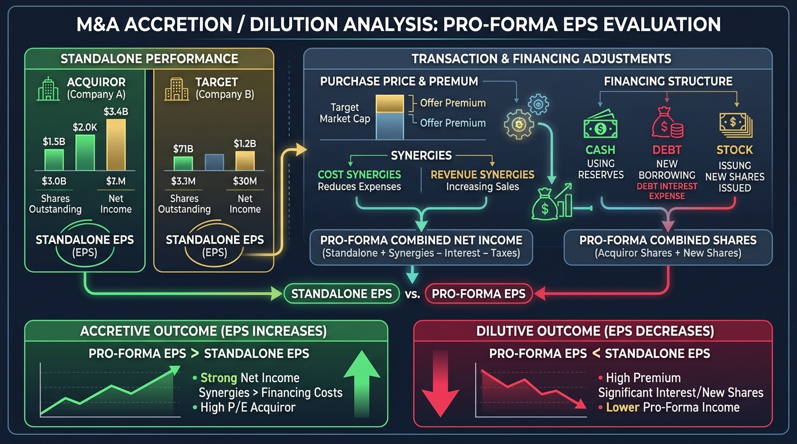

### Accretion vs. Dilution
An analysis assessing whether a proposed corporate acquisition increases or decreases the acquirer's standalone Earnings Per Share (EPS).
* **Accretive Deal (Green)**: $\text{Pro-Forma EPS} > \text{Standalone EPS}$ (EPS increases $\rightarrow$ Favorable for acquirer's stock).
* **Dilutive Deal (Red)**: $\text{Pro-Forma EPS} < \text{Standalone EPS}$ (EPS decreases $\rightarrow$ Potential shareholder pushback).

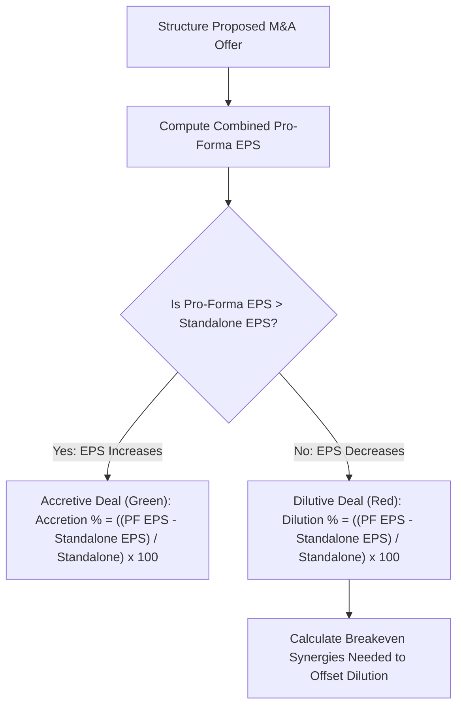
```mermaid
flowchart TD
    Deal["Structure Proposed M&A Offer"] --> Calc["Compute Combined Pro-Forma EPS"]
    Calc --> Test{"Is Pro-Forma EPS > Standalone EPS?"}
    Test -->|"Yes: EPS Increases"| Accretive["Accretive Deal (Green): Accretion % = ((PF EPS - Standalone EPS) / Standalone) x 100"]
    Test -->|"No: EPS Decreases"| Dilutive["Dilutive Deal (Red): Dilution % = ((PF EPS - Standalone EPS) / Standalone) x 100"]
    Dilutive --> Synergies["Calculate Breakeven Synergies Needed to Offset Dilution"]
```

---

### Standalone EPS vs. Pro-Forma EPS
* **Standalone EPS**: Current earnings per share of the acquirer before transaction closing.
$$\text{EPS}_{\text{standalone}} = \frac{\text{Acquirer Net Income}}{\text{Acquirer Shares Outstanding}}$$
* **Pro-Forma EPS**: Projected earnings per share of the combined corporation post-merger, factoring in synergies, deal interest, and newly issued shares.
$$\text{EPS}_{\text{pro-forma}} = \frac{\text{Combined Net Income} + \text{Synergies}(1-t) - \text{Deal Interest}(1-t)}{\text{Acquirer Shares} + \text{New Shares Issued}}$$

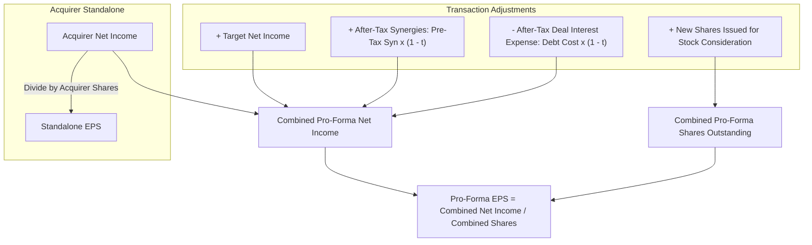
```mermaid
flowchart TD
    subgraph StandaloneSide ["Acquirer Standalone"]
        ANI["Acquirer Net Income"] -->|"Divide by Acquirer Shares"| SEPS["Standalone EPS"]
    end
    subgraph AdjustmentsSide ["Transaction Adjustments"]
        TNI["+ Target Net Income"]
        SYN["+ After-Tax Synergies: Pre-Tax Syn x (1 - t)"]
        INT["- After-Tax Deal Interest Expense: Debt Cost x (1 - t)"]
        NEW_SH["+ New Shares Issued for Stock Consideration"]
    end
    ANI & TNI & SYN & INT --> PF_NI["Combined Pro-Forma Net Income"]
    NEW_SH --> PF_SH["Combined Pro-Forma Shares Outstanding"]
    PF_NI & PF_SH --> PFEPS["Pro-Forma EPS = Combined Net Income / Combined Shares"]
```

---

### Offer Price & Offer Premium
The price per share the acquirer offers for target stock, including an incentive premium over the current trading price.
* **Offer Price**:
$$\text{Offer Price} = \text{Target Share Price} \times (1 + \text{Offer Premium})$$
* **Total Deal Value (Equity Purchase Price)**:
$$\text{Total Deal Value} = \text{Offer Price} \times \text{Target Shares Outstanding}$$

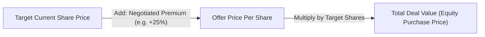
```mermaid
flowchart LR
    Base["Target Current Share Price"] -->|"Add: Negotiated Premium (e.g. +25%)"| Offer["Offer Price Per Share"]
    Offer -->|"Multiply by Target Shares"| Total["Total Deal Value (Equity Purchase Price)"]
```

---

### Financing Consideration (Cash vs. Stock)
The capital mix chosen by the acquirer to fund the purchase consideration.
1. **Cash Consideration**: Funded using cash reserves or new debt borrowing. Incurs ongoing interest expense:
$$\text{After-Tax Interest Expense} = (\text{Cash Needed} \times \text{Borrowing Rate}) \times (1 - t)$$
2. **Stock Consideration**: Acquirer prints and issues brand new shares to target owners. Dilutes share count:
$$\text{New Shares Issued} = \frac{\text{Stock Value Consideration}}{\text{Acquirer Share Price}}$$

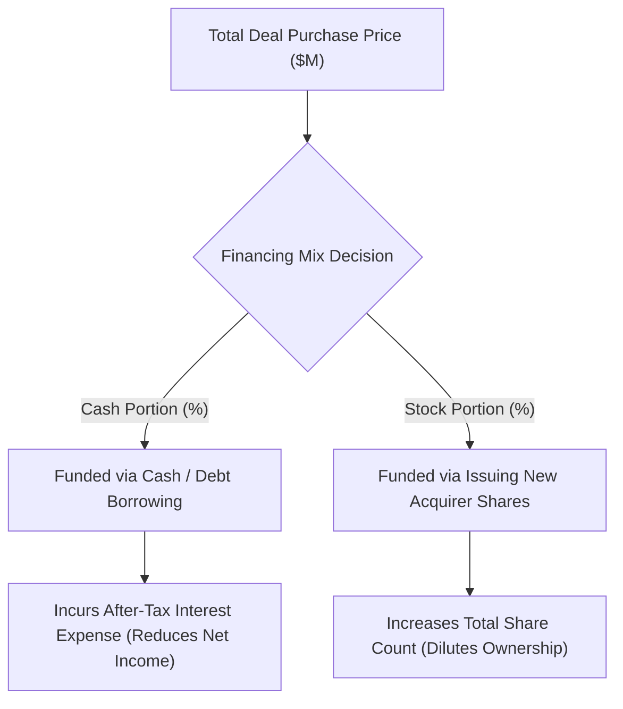
```mermaid
flowchart TD
    PurchaseVal["Total Deal Purchase Price ($M)"] --> Decision{"Financing Mix Decision"}
    Decision -->|"Cash Portion (%)"| CashBranch["Funded via Cash / Debt Borrowing"]
    CashBranch --> IntExp["Incurs After-Tax Interest Expense (Reduces Net Income)"]
    Decision -->|"Stock Portion (%)"| StockBranch["Funded via Issuing New Acquirer Shares"]
    StockBranch --> Dilute["Increases Total Share Count (Dilutes Ownership)"]
```

---

### Synergies (Cost vs. Revenue)
Expected operational enhancements that increase cash flow after merging two businesses.
* **Cost Synergies (Hard Synergies)**: Eliminating redundant departments, software licenses, supply chains, and real estate.
* **Revenue Synergies (Soft Synergies)**: Cross-selling products to new geographic or customer segments.

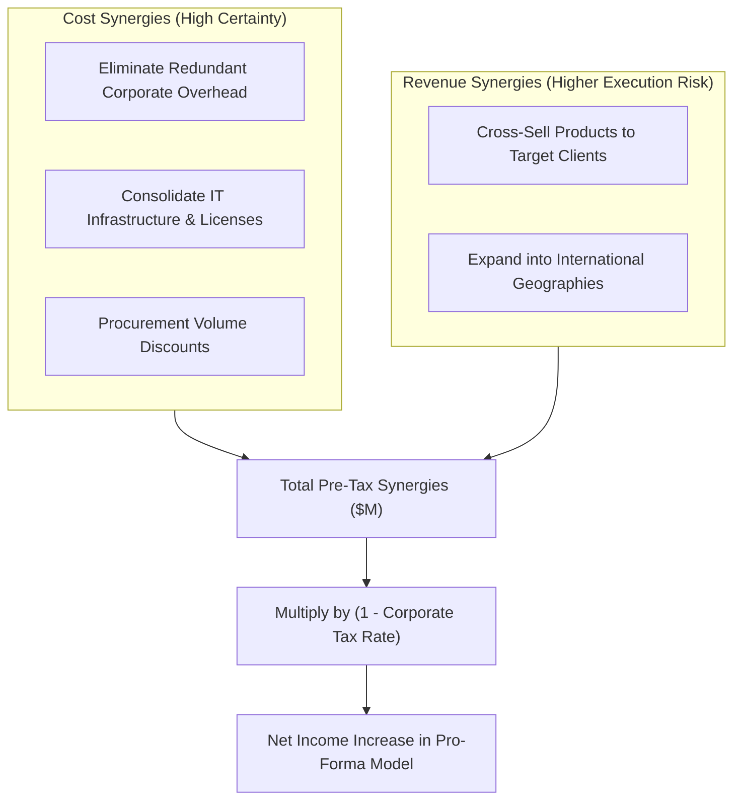
```mermaid
flowchart TD
    subgraph HardSyn ["Cost Synergies (High Certainty)"]
        C1["Eliminate Redundant Corporate Overhead"]
        C2["Consolidate IT Infrastructure & Licenses"]
        C3["Procurement Volume Discounts"]
    end
    subgraph SoftSyn ["Revenue Synergies (Higher Execution Risk)"]
        R1["Cross-Sell Products to Target Clients"]
        R2["Expand into International Geographies"]
    end
    HardSyn & SoftSyn --> PreTax["Total Pre-Tax Synergies ($M)"]
    PreTax --> TaxAdjust["Multiply by (1 - Corporate Tax Rate)"]
    TaxAdjust --> BottomLine["Net Income Increase in Pro-Forma Model"]
```

---

### Breakeven Synergies
The minimum dollar amount of pre-tax synergies required to make an otherwise dilutive M&A transaction earnings-neutral (0% change in EPS).

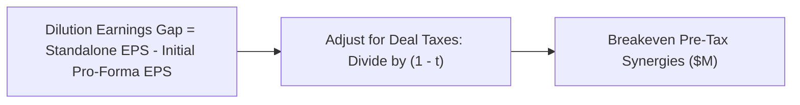
```mermaid
flowchart LR
    DilutionGap["Dilution Earnings Gap = Standalone EPS - Initial Pro-Forma EPS"] --> Factor["Adjust for Deal Taxes: Divide by (1 - t)"]
    Factor --> Breakeven["Breakeven Pre-Tax Synergies ($M)"]
```

---

## 3. Agentic Hybrid RAG & SEC Document Ingestion

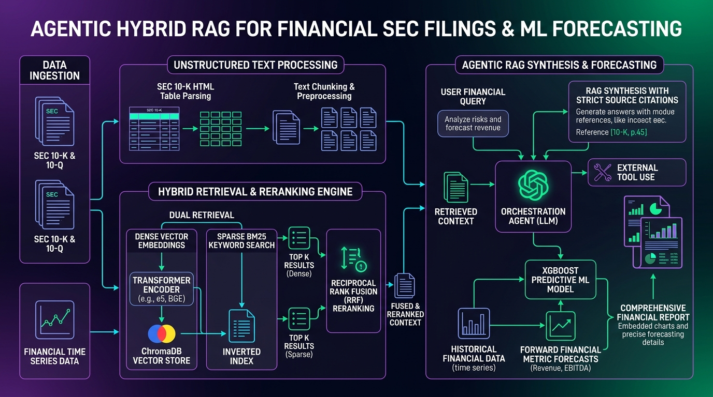

### RAG (Retrieval-Augmented Generation)
An artificial intelligence paradigm combining information retrieval with large language models (LLMs) to retrieve verified source documents (like SEC filings) before synthesizing responses, eliminating hallucinations.

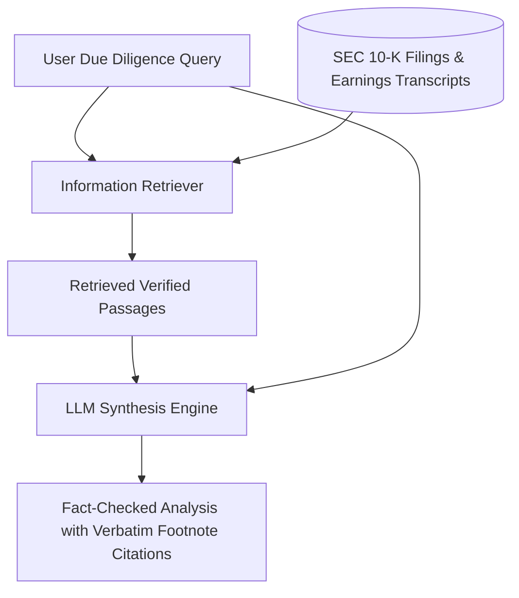
```mermaid
flowchart TD
    UserQ["User Due Diligence Query"] --> Retriever["Information Retriever"]
    Knowledge[("SEC 10-K Filings & Earnings Transcripts")] --> Retriever
    Retriever --> Context["Retrieved Verified Passages"]
    Context & UserQ --> LLM["LLM Synthesis Engine"]
    LLM --> Answer["Fact-Checked Analysis with Verbatim Footnote Citations"]
```

---

### Agentic RAG Architecture
An advanced autonomous workflow where an AI agent plans multi-step retrieval, invokes deterministic financial calculators, and verifies its own factual citations before producing investment committee briefs.

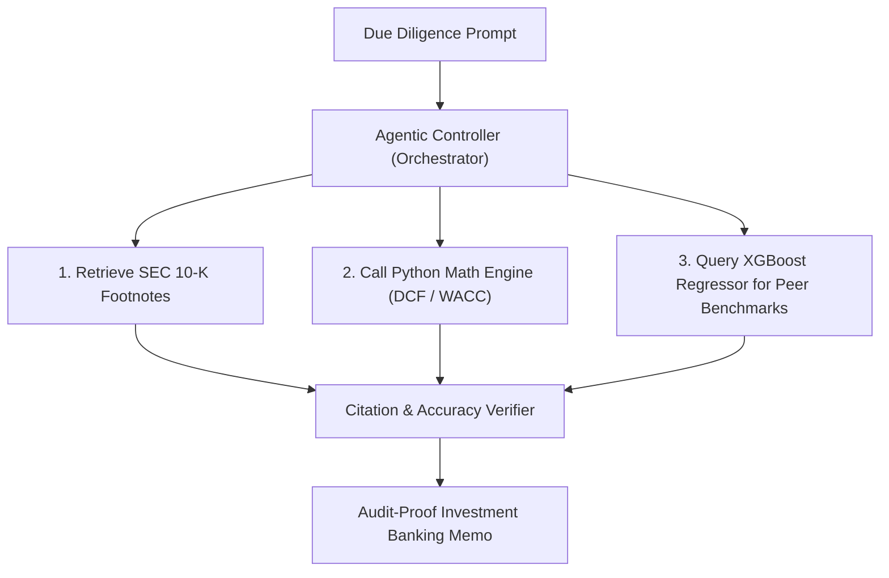
```mermaid
flowchart TD
    UserPrompt["Due Diligence Prompt"] --> Planner["Agentic Controller (Orchestrator)"]
    Planner --> RAGStep["1. Retrieve SEC 10-K Footnotes"]
    Planner --> MathStep["2. Call Python Math Engine (DCF / WACC)"]
    Planner --> MLStep["3. Query XGBoost Regressor for Peer Benchmarks"]
    RAGStep & MathStep & MLStep --> Verifier["Citation & Accuracy Verifier"]
    Verifier --> Report["Audit-Proof Investment Banking Memo"]
```

---

### Hybrid Search (Dense Vector + Sparse BM25)
A dual-retrieval pipeline combining Dense Vector Embeddings (semantic concept matching) with Sparse BM25 Keyword Search (exact terminology and numerical matching).

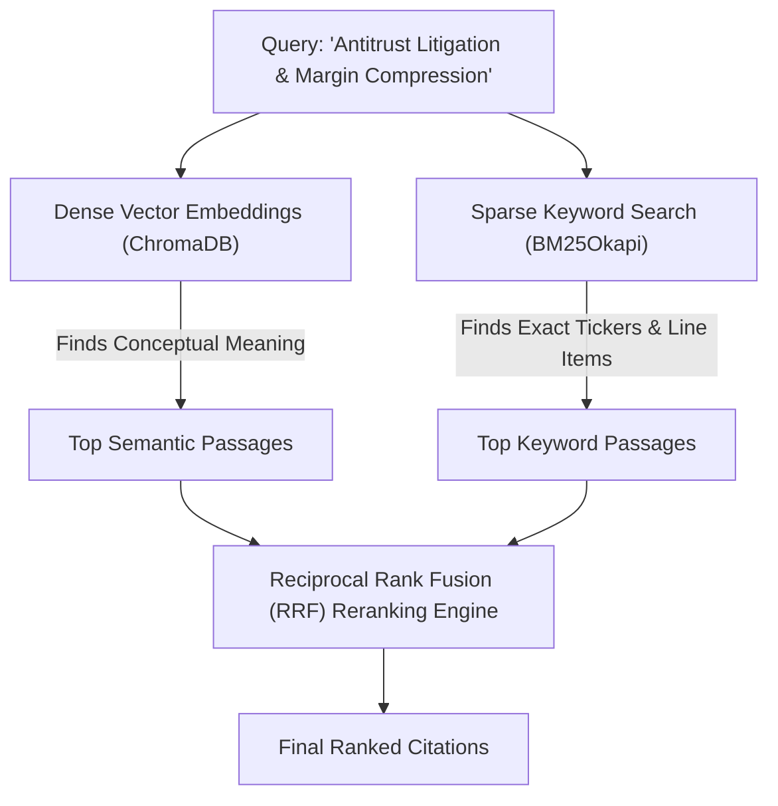
```mermaid
flowchart TD
    UserQuery["Query: 'Antitrust Litigation & Margin Compression'"] --> DensePath["Dense Vector Embeddings (ChromaDB)"]
    UserQuery --> SparsePath["Sparse Keyword Search (BM25Okapi)"]
    DensePath -->|"Finds Conceptual Meaning"| DenseDocs["Top Semantic Passages"]
    SparsePath -->|"Finds Exact Tickers & Line Items"| SparseDocs["Top Keyword Passages"]
    DenseDocs & SparseDocs --> RRFMerge["Reciprocal Rank Fusion (RRF) Reranking Engine"]
    RRFMerge --> FusedOutput["Final Ranked Citations"]
```

---

### Reciprocal Rank Fusion (RRF)
A mathematical score-fusion algorithm that combines rankings from different retrieval systems without requiring score normalization:
$$\text{RRF Score}(d) = \sum_{m \in M} \frac{1}{k + r_m(d)}$$
* **$r_m(d)$**: The rank of document $d$ in search method $m$.
* **$k$**: Smoothing constant (default is 60).

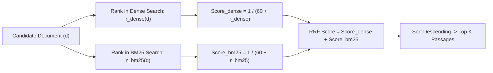
```mermaid
flowchart LR
    CandidateDoc["Candidate Document (d)"] --> RankDense["Rank in Dense Search: r_dense(d)"]
    CandidateDoc --> RankSparse["Rank in BM25 Search: r_bm25(d)"]
    RankDense --> Score1["Score_dense = 1 / (60 + r_dense)"]
    RankSparse --> Score2["Score_bm25 = 1 / (60 + r_bm25)"]
    Score1 & Score2 --> AddScores["RRF Score = Score_dense + Score_bm25"]
    AddScores --> SortList["Sort Descending -> Top K Passages"]
```

---

### SEC Form 10-K & 10-Q Filings
Mandatory regulatory disclosures filed by public companies with the U.S. Securities and Exchange Commission:
* **Form 10-K**: Comprehensive annual audited report covering business operations, audited financial statements, and executive analysis.
* **Form 10-Q**: Unaudited quarterly financial statement filed for Q1, Q2, and Q3.

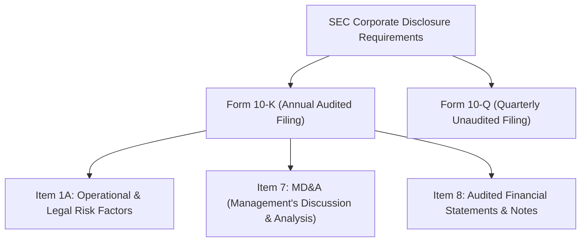
```mermaid
flowchart TD
    Filing["SEC Corporate Disclosure Requirements"] --> K10["Form 10-K (Annual Audited Filing)"]
    Filing --> Q10["Form 10-Q (Quarterly Unaudited Filing)"]
    K10 --> Item1A["Item 1A: Operational & Legal Risk Factors"]
    K10 --> Item7["Item 7: MD&A (Management's Discussion & Analysis)"]
    K10 --> Item8["Item 8: Audited Financial Statements & Notes"]
```

---

### Item 1A (Risk Factors) & Item 7 (MD&A)
* **Item 1A (Risk Factors)**: Mandatory section outlining material operational, legal, geopolitical, cyber, and competitive risks facing the enterprise.
* **Item 7 (MD&A)**: Executive management's qualitative analysis explaining historical operating results, liquidity, margins, and forward strategy.

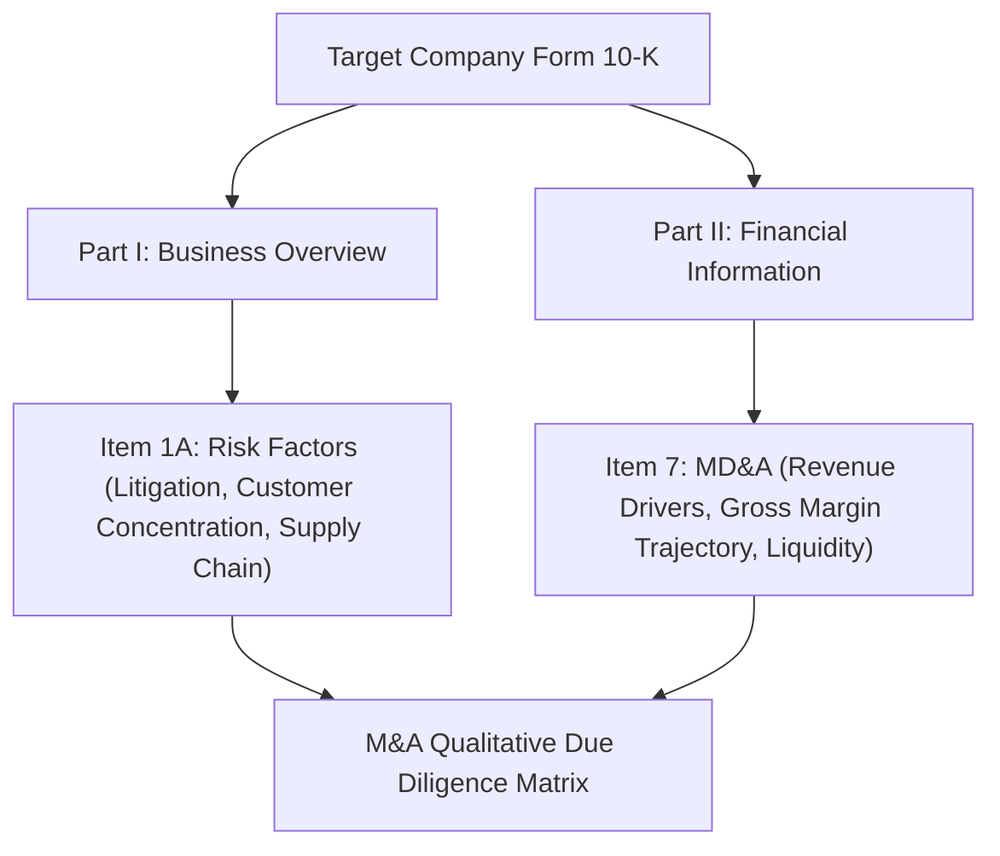
```mermaid
flowchart TD
    Filing10K["Target Company Form 10-K"] --> PartI["Part I: Business Overview"]
    Filing10K --> PartII["Part II: Financial Information"]
    PartI --> RiskFactors["Item 1A: Risk Factors (Litigation, Customer Concentration, Supply Chain)"]
    PartII --> MDA["Item 7: MD&A (Revenue Drivers, Gross Margin Trajectory, Liquidity)"]
    RiskFactors & MDA --> DueDiligenceReport["M&A Qualitative Due Diligence Matrix"]
```

---

### Table-Aware HTML Ingestion
A parser algorithm that preserves HTML `<table>` elements in regulatory filings as structured Markdown tables, preventing balance sheets from being split across chunk boundaries.

```mermaid
flowchart TD
    RawHTML["Raw SEC Filing HTML"] --> Parser["SECTableAwareParser"]
    Parser --> Detect{"Tag Type?"}
    Detect -->|"<table> Tag"| TableFlow["Convert Complete Rows & Cells into Markdown Table String"]
    Detect -->|"<p> / <div> Tag"| TextFlow["Extract Text & Buffer to ~800 Character Overlapping Chunks"]
    TableFlow --> StoreTable["Chunk Indexed as 'table' (is_financial_table = True)"]
    TextFlow --> StoreText["Chunk Indexed as 'text' (is_financial_table = False)"]
    StoreTable & StoreText --> VectorDB[("ChromaDB & BM25 Knowledge Base")]
```

---

## 4. Predictive Machine Learning & Statistical Analytics

### XGBoost Regressor
An optimized gradient boosting decision tree ensemble that predicts forward financial metrics (1-year revenue growth rate, EBITDA margins) based on historical peer feature vectors.

```mermaid
flowchart TD
    subgraph FeatureInputs ["Feature Matrix (X)"]
        F1["Historical Revenue CAGR (%)"]
        F2["30-Day Realized Volatility (%)"]
        F3["Debt-to-Equity Ratio (D/E)"]
        F4["Current Operating Margin (%)"]
    end
    FeatureInputs --> Ensemble["XGBoost Ensemble (100 Trees, Depth=4)"]
    Ensemble --> Preds["Predicted Forward Metrics"]
    Preds --> O1["1-Yr Forward Revenue Growth Rate"]
    Preds --> O2["Forward EBITDA Margin"]
    Preds --> O3["Anchored DCF Terminal Growth Rate"]
```

---

### 30-Day Realized Stock Volatility
The annualized standard deviation of daily stock returns over the preceding 30 trading days:
$$\sigma = \sqrt{\frac{1}{N-1}\sum_{i=1}^N (R_i - \bar{R})^2} \times \sqrt{252}$$
* **Role**: Measures uncertainty in market valuation; higher volatility indicates heightened market risk and expands required WACC discount rates.

```mermaid
flowchart LR
    P["Daily Close Prices (30 Days)"] --> R["Compute Daily Returns: (P_t - P_{t-1}) / P_{t-1}"]
    R --> S["Calculate Sample Standard Deviation (σ_daily)"]
    S --> A["Annualize: Multiply by Sqrt(252 Trading Days)"]
    A --> Vol["Annualized 30-Day Realized Volatility (%)"]
```

---

### Debt-to-Equity (D/E) Ratio
A fundamental solvency and leverage metric:
$$\text{Debt-to-Equity} = \frac{\text{Total Debt}}{\text{Total Shareholders' Equity}}$$
* Higher leverage increases financial distress risk, raising beta ($eta$) and cost of equity ($K_e$).

```mermaid
flowchart TD
    TotalDebt["Total Corporate Debt"] --> Divide["Divide by Total Shareholders' Equity"]
    TotalEquity["Total Shareholders' Equity"] --> Divide
    Divide --> DE["Debt-to-Equity (D/E) Ratio"]
    DE --> Assessment{"Leverage Profile"}
    Assessment -->|"High D/E (> 1.5x)"| HighDistress["Elevated Default Risk -> Higher Cost of Capital -> Multiple Discount"]
    Assessment -->|"Low D/E (< 0.5x)"| LowDistress["Conservative Balance Sheet -> Resilient Valuation"]
```

---

### Operating Margin (EBIT Margin)
Operating income (EBIT) as a percentage of total revenue:
$$\text{Operating Margin} = \frac{\text{EBIT}}{\text{Total Revenue}}$$
* Demonstrates operating profitability and pricing power before interest expenses and corporate taxes.

```mermaid
flowchart TD
    Rev["Total Gross Revenue (100%)"] --> COGS["- Cost of Goods Sold (COGS)"]
    COGS --> GP["Gross Profit"]
    GP --> SGNA["- SG&A Expenses (Selling, General & Administrative)"]
    GP --> RD["- Research & Development (R&D)"]
    SGNA & RD --> EBIT["Operating Income (EBIT)"]
    EBIT --> Div["Divide by Total Revenue"]
    Div --> Margin["Operating Margin (%) = EBIT / Total Revenue"]
```

---

### Model Evaluation Metrics (MSE, RMSE, MAE, R²)
Statistical metrics quantifying forecasting accuracy and residuals between actual and predicted financial parameters:
* **MSE (Mean Squared Error)**: $\frac{1}{n} \sum (y_i - \hat{y}_i)^2$
* **RMSE (Root Mean Squared Error)**: $\sqrt{\text{MSE}}$ (interpretable in original units)
* **MAE (Mean Absolute Error)**: $\frac{1}{n} \sum |y_i - \hat{y}_i|$
* **$R^2$ (Coefficient of Determination)**: Proportion of variance explained ($1.0$ is perfect fit).

```mermaid
flowchart TD
    Actuals["Actual Historical Ground Truth (y_test)"] --> Residuals["Calculate Residuals: e_i = (y_actual - y_pred)"]
    Predictions["Model Forecasts (y_pred)"] --> Residuals
    Residuals --> MSE["MSE: Mean Squared Error (Average of e_i^2)"]
    MSE --> RMSE["RMSE: Root Mean Squared Error (Sqrt of MSE)"]
    Residuals --> MAE["MAE: Mean Absolute Error (Average of |e_i|)"]
    Residuals --> R2["R²: Variance Explained (1.0 = 100% Accuracy)"]
```

---

## 5. Quick Reference Formula Cheatsheet

| Financial / Technical Metric | Formula / Definition | deal.ml Module |
| :--- | :--- | :--- |
| **WACC** | $\left(\frac{E}{V} \cdot K_e\right) + \left(\frac{D}{V} \cdot K_d \cdot (1-t)\right)$ | `src.ml_engine.valuation_math` |
| **Gordon Growth TV** | $\frac{\text{FCF}_n \cdot (1+g)}{\text{WACC} - g}$ | `src.ml_engine.valuation_math` |
| **Exit Multiple TV** | $\text{Terminal EBITDA} \times \text{Exit Multiple}$ | `src.ml_engine.valuation_math` |
| **Enterprise Value** | $\text{PV}(\text{FCFs}) + \text{PV}(\text{TV})$ | `src.ml_engine.valuation_math` |
| **Equity Value** | $\text{Enterprise Value} - \text{Net Debt}$ | `src.ml_engine.valuation_math` |
| **Implied Share Price** | $\frac{\text{Equity Value}}{\text{Shares Outstanding}}$ | `src.ml_engine.valuation_math` |
| **Deal Value** | $\text{Target Share Price} \times (1 + \text{Premium}) \times \text{Shares}$ | `src.ml_engine.valuation_math` |
| **Pro-Forma EPS** | $\frac{\text{Acq NI} + \text{Tgt NI} + \text{Syn}(1-t) - \text{Debt Int}(1-t)}{\text{Acq Shares} + \text{New Shares Issued}}$ | `src.ml_engine.valuation_math` |
| **RRF Score** | $\sum \frac{1}{60 + \text{Rank}}$ | `src.rag_engine.hybrid_retriever` |
| **Forward Growth Prediction** | $\text{XGBoost}(\text{Growth}_{\text{hist}}, \sigma_{30D}, D/E, \text{Margin}_{\text{op}})$ | `src.ml_engine.metrics_forecaster` |
