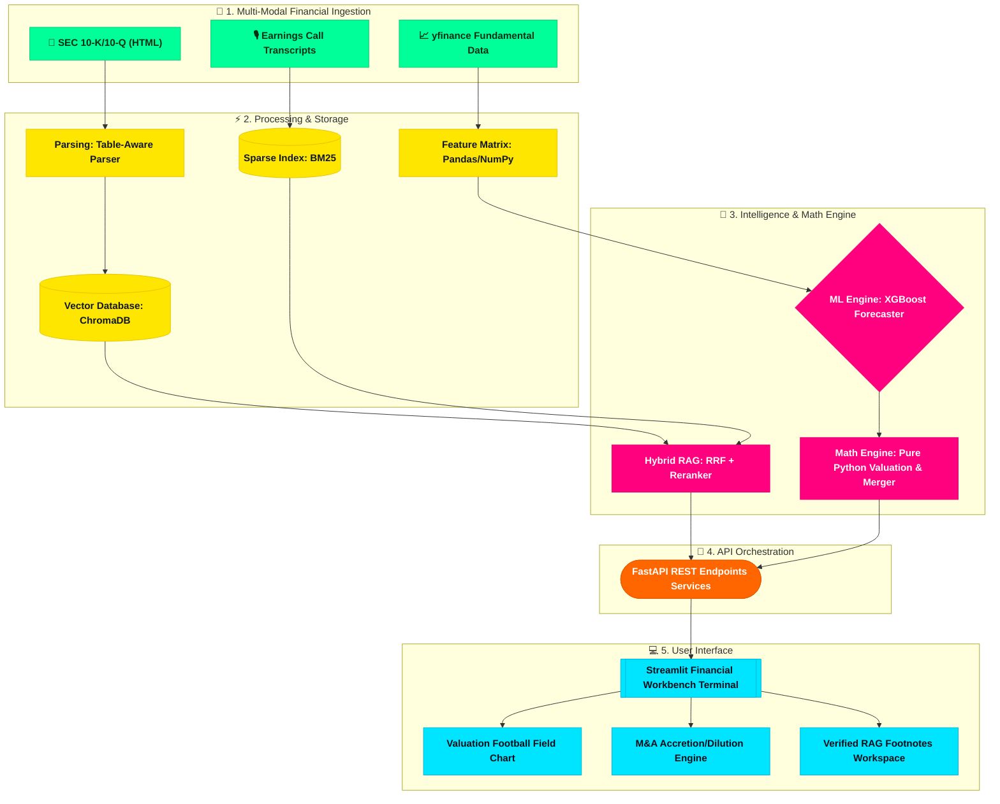

# deal.ml | Agentic RAG & Predictive ML System for Automated M&A Due Diligence & Valuation

> **An Enterprise Financial Machine Learning & RAG Platform for Global Investment Banking Analysts.**


---

## Executive Summary

Investment bankers at top-tier financial institutions evaluate corporate acquisitions, build financial valuation models (DCF and Comps), and execute due diligence on public and private companies. Raw Large Language Models (LLMs) fail at financial modeling because LLMs hallucinate calculations and struggle with tabular accounting statements.

**`deal.ml`** solves this by uniting **Agentic Hybrid RAG** (for text and SEC table extraction) with a **Deterministic Python Mathematical Engine** (for zero-hallucination DCF, WACC, and M&A Accretion/Dilution models) and an **XGBoost Machine Learning Forecaster** (for predicting forward growth and margin trajectory based on peer market data).

---

## System Architecture & Workflow



---

## 1. Core Financial Data Files

| Data Source | Format | Purpose | Extraction Strategy |
| :--- | :--- | :--- | :--- |
| **SEC 10-K / 10-Q Filings** | HTML / Markdown | Item 1A (Risk Factors) & Item 7 (MD&A) qualitative risk analysis | `SECTableAwareParser` isolates `<table>` tags to prevent splitting tables in half |
| **Earnings Call Transcripts** | Text / Markdown | Management sentiment and Wall Street analyst Q&A | Text chunking (~800 chars) with overlap and metadata indexing |
| **Historical Financial Statements** | Tabular CSV / `yfinance` | Balance Sheets, Income Statements, and Cash Flow Statements | Programmatic Extraction via `MarketDataPipeline` |
| **Market Valuation Multiples** | Tabular DataFrame | Peer P/E, EV/EBITDA, 52-Week High/Low trading ranges | Normalized feature vectors for XGBoost forecasting |

---

## 2. Technology Stack

- **Language**: 100% Python 3.10 (Zero R code)
- **Mathematical Execution**: Pure Python NumPy / Pandas (Deterministic, Audit-proof)
- **Machine Learning**: XGBoost, Scikit-Learn (Predictive metrics & parameter forecasting)
- **Agentic RAG & Vector Store**: ChromaDB, BM25 (`rank_bm25`), Reciprocal Rank Fusion (RRF)
- **Backend API**: FastAPI, Uvicorn, Pydantic
- **Frontend Dashboard**: Streamlit, Plotly (Financial Football Fields & Pro-Forma Charts)
- **DevOps & Deployment**: Docker, Docker Compose, MLflow

---

## 3. Quick Start & Execution

### Prerequisites
- Python 3.10+
- Docker & Docker Compose (Optional for containerized run)

### Running Locally with Python
```bash
# 1. Clone/Navigate to workspace
cd deal.ml

# 2. Install dependencies
pip install -r requirements.txt

# 3. Launch FastAPI Backend (Terminal 1)
uvicorn src.backend.main:app --host 0.0.0.0 --port 8000 --reload

# 4. Launch Streamlit Financial Terminal (Terminal 2)
streamlit run frontend/app.py
```

### Running with Docker Compose (Modern Docker CLI v2)
```bash
docker compose up --build
```

*(Note: If using older legacy standalone docker-compose, use `docker-compose up --build`)*

Access the application at:
- **Streamlit Terminal**: `http://localhost:8501`
- **FastAPI API Docs**: `http://localhost:8000/docs`

---

 
